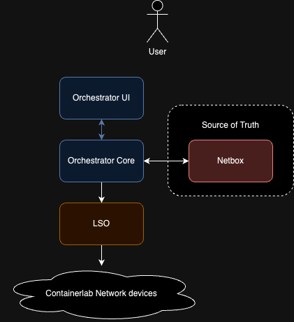

# Example Orchestrator Workshop Overview

## Intended audience

This workshop is intended for those who are interested in using the Workflow Orchestrator as network orchestrator, but 
is also accessible to those who are new to the Workflow Orchestrator and would like to use it as a generic orchestrator. 
The main goal of this workshop is to introduce you to how to write orchestrator workflows that talk to external systems,
as well as teaching you how to relate products to other products, using the dependency model of the
Workflow Orchestrator.

!!! tip
    Knowledge of the Python programming language, Docker, and the Unix command line interface are prerequisites for this workshop.


## Topics

* **Installation**  
  Detailed instructions are given on how to prepare your environment and install the orchestrator and GUI using docker compose.
* **Start applications**  
  Outline how to start the Workflow Orchestrator backend and GUI using docker compose.
* **Bootstrapping the applications and familiarisation**  
  Through a simple network node and network circuit scenario, a set of products is created showing how domain models are defined.
  * **Domain models**  
    Explains the benefits of the use of domain models and shows how the hierarchy of products, product blocks, fixed inputs and resource types are used to create product subscriptions for customers.
  * **Database migration**  
    Use the orchestrator CLI to create an Alembic database migration based on the domain models that describe the created products and product blocks.
* **Create Node and Circuit Workflows**  
  For the Node and Circuit products, we will make CREATE workflows. The use of input forms is explained as part of defining the create workflow. The Node product will introduce connecting to an external system from within a workflow, and then the Circuit workflow will build upon the existing Node subscriptions to highlight the ability to link products in the Workflow Orchestrator as dependencies. The circuit workflow will also demonstrate using the forms library to create complex objects in external systems.

## Workshop folder layout

This workshop uses the following folder layout:

```text
├── migrations
│   └── versions
│   └── schema
├── products
│   ├── product_blocks
│   ├── product_types
│   └── services
│   └── <service>
├── services
│ └── <service>
├── templates
├── translations
├── utils
└── workflows
├── <product>
└── tasks
37 directories, 99 files
```

## Workshop software architecture
The workshop combines as said a number of opensource software components that can provision a simulated network 
running in container lab. The following diagram shows the logical components of the application and how the data 
flows. In reality there are a number of extra services like Postgres and Redis that store the application data of 
the Orchestrator, Netbox and LSO.



## Workshop topology
Assuming you have installed the example orchestartor with containerlab integration enabled. We need to build the 
workshop topology that can be used to actually see packets flow. The workflows that you will run in the following 
steps will do the following:

* Seed Netbox
* Provision two PE nodes
* Create an IS-IS cloud to signal MPLS LSP's with backbone links
* Provision customer Ports that can be used in network services

The topology will be as follows:


Host 1 and Host 2 will be pre-provisioned, but the routers will need to be bootstrapped from scratch to work.
